# Library Management System

A full-stack library management web application built with React.js, Express, and MongoDB. This project demonstrates user authentication, role-based access, CRUD operations, and API integration.

## Features

**User:** Browse books, borrow/return, view personal loan history

**Admin:** Manage books, add via form or Google Books API, view all loans, dashboard analytics

**Authentication:** JWT-based login and refresh token support

**Search & Filter:** Find books by title, author, or genre; filter by availability

## Tech Stack

**Frontend:** React.js, React Router DOM, Axios

**Backend:** Express

**Database:** MongoDB

**Authentication:** JWT

**APIs:** Google Books API for fetching book details by ISBN

## Screenshots

### Homepage
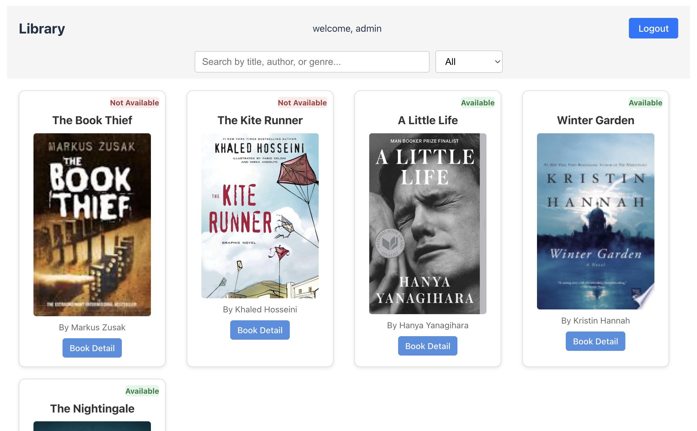

Browse all books, search by title/author/genre, and filter by availability. Shows book availability status.

### Book Details
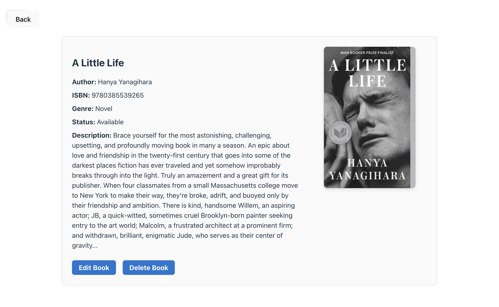
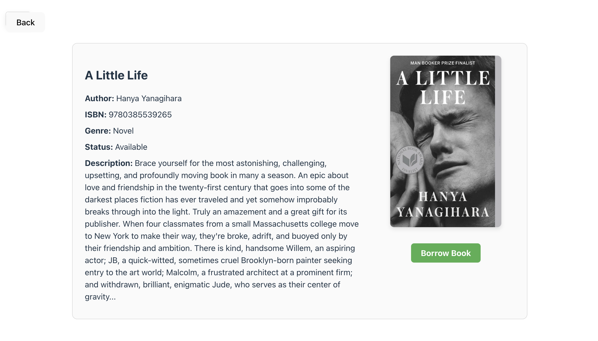
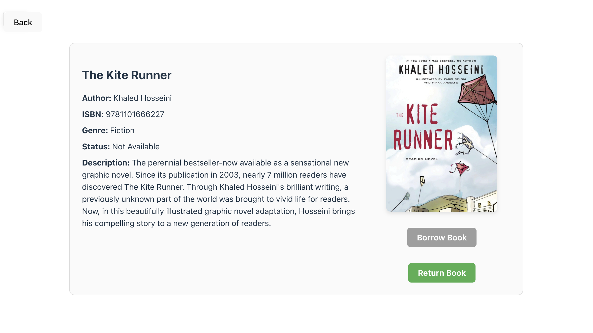

View detailed information about a book. Users can borrow or return books. Admins can edit or delete books.

### Admin Dashboard
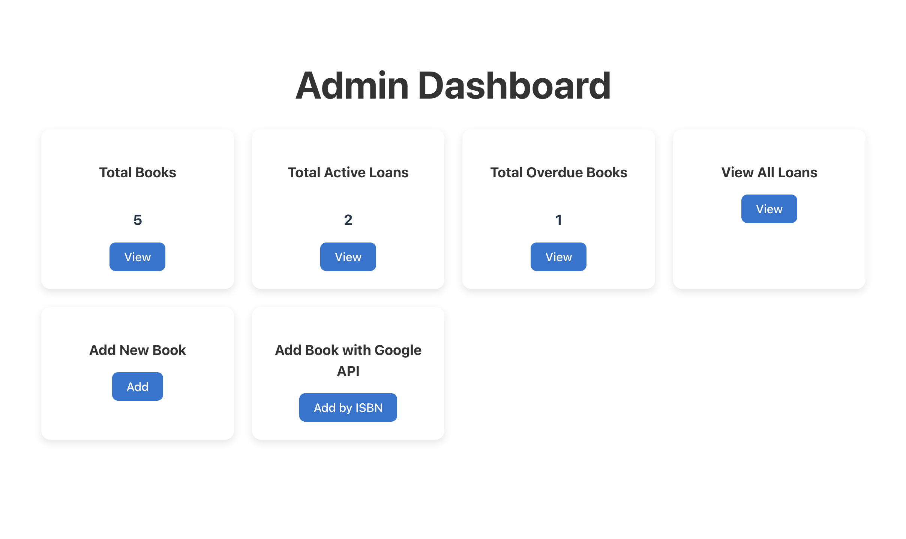

Overview of total books, active loans, overdue books, and quick access to add books or manage loans.

### Add New Book
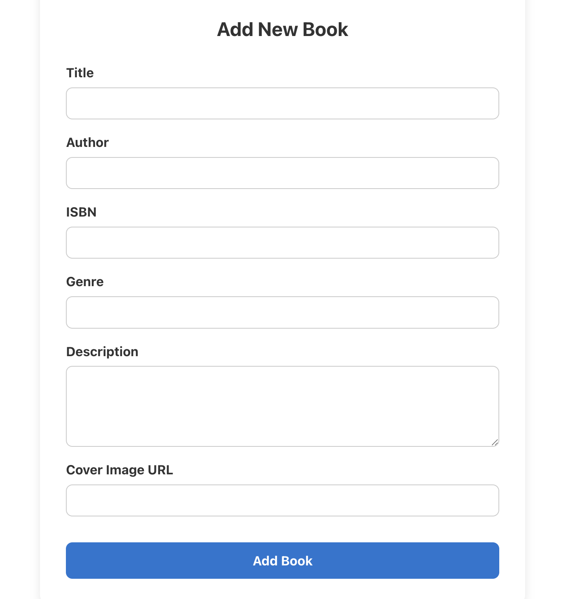

Admins can manually add a new book with title, author, ISBN, genre, description, and cover image.

### Add Book by ISBN (Google API)
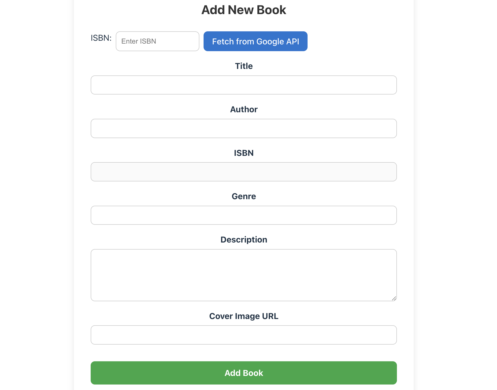

Admins can fetch book details from Google Books API using ISBN and add it automatically.

### Loan History
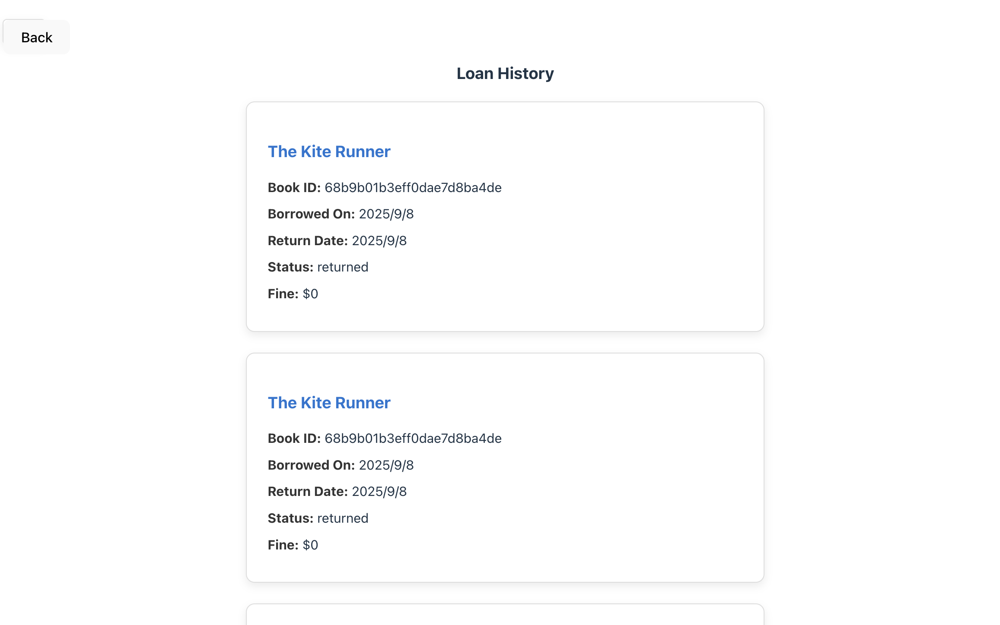

Users can view their past and current loans with status and borrow/return dates.

### Active Loans
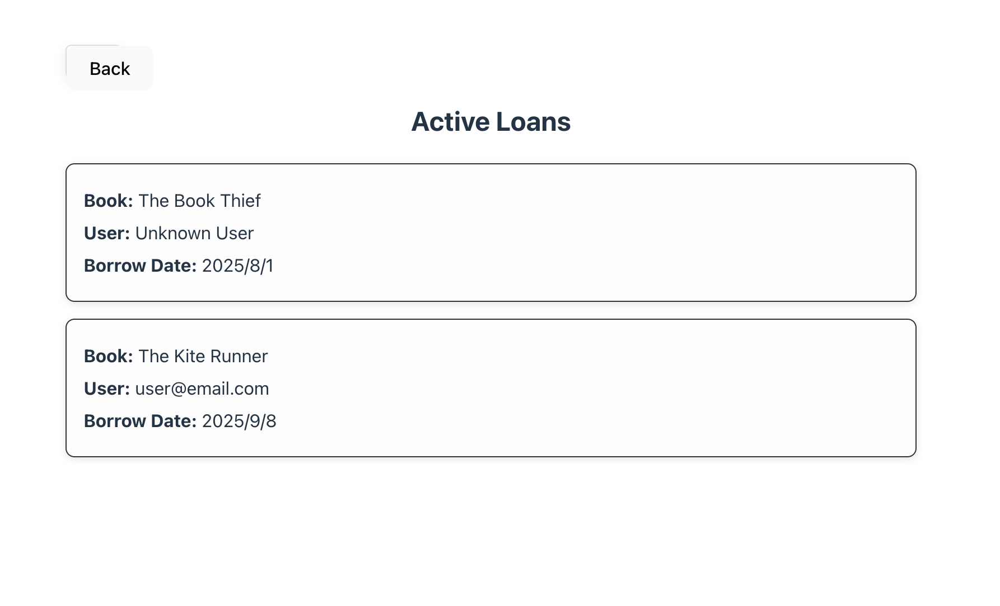

Admins can see all books currently borrowed and by which user.

### Overdue Loans
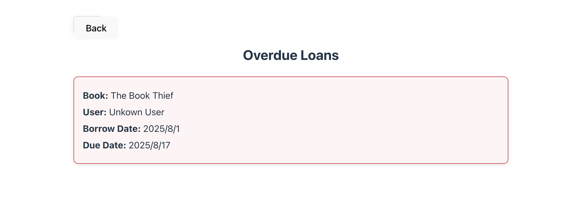

Admins can track overdue books, showing borrower and due date.

### View All Loans
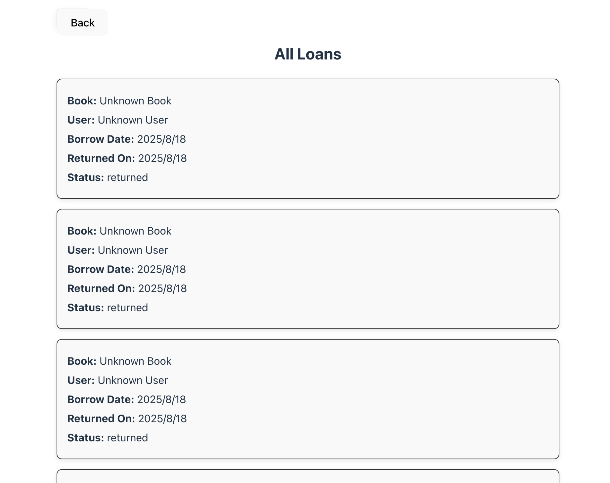

Admins can view complete loan history for all users, including borrow and return dates and status.
